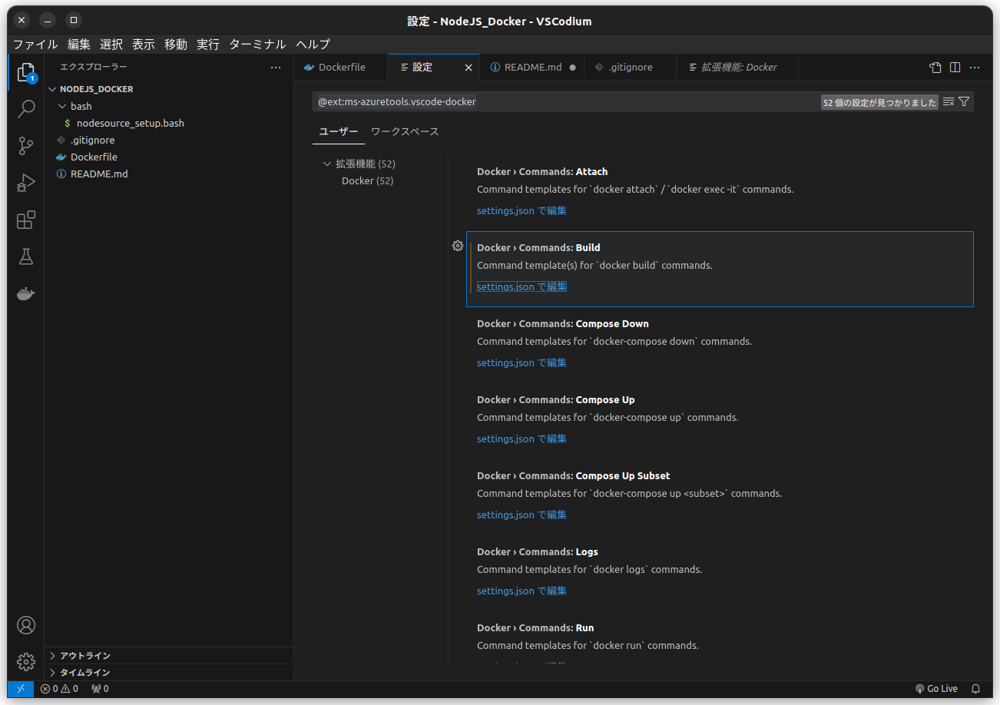
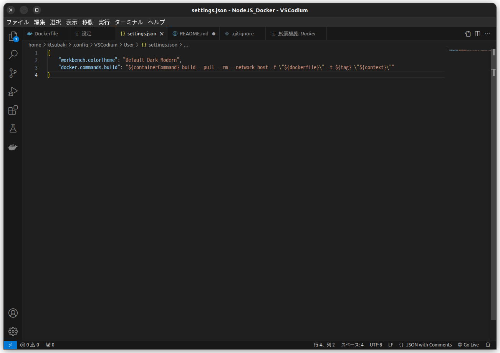
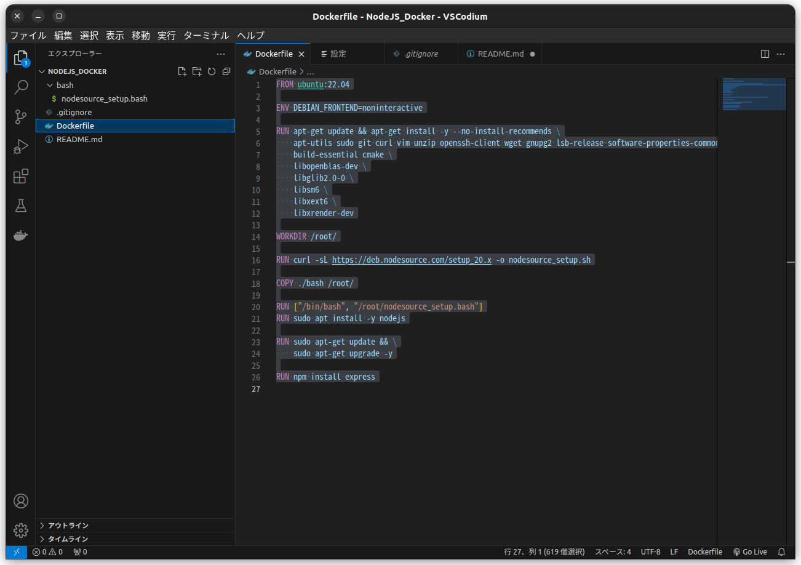
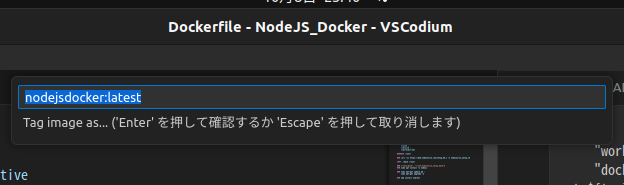
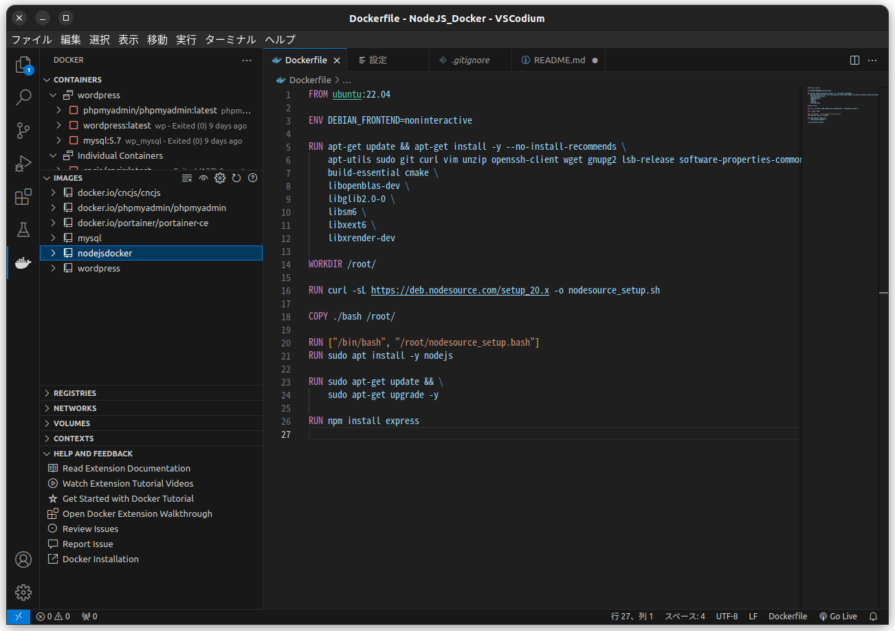
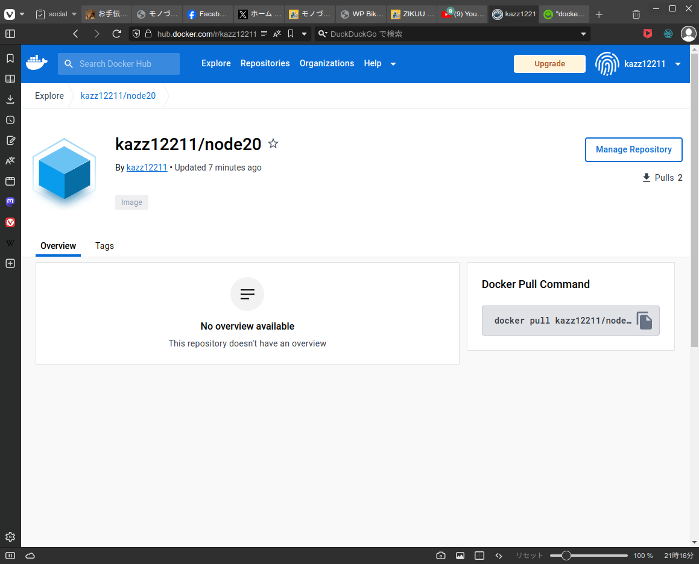

# Ubuntu 22.04をベースにNodeJS 20.xをインストールしたイメージを作成する

## VSCodiumでプロジェクトを作成

VSCodiumには予めDocker拡張機能をインストールしておく。

### プロジェクト名

```
NodeJS_Docker
```

### ディレクトリーツリー

```
./NodJS_Docker
  - bash
      nodesource_setup.bash
  Dockerfile
```

### nodesource_setup.bashの作成

次の内容で作成する。

```
sudo bash nodesource_setup.sh
```

### Dockerfileの作成

次の内容で作成する。

```
FROM ubuntu:22.04

ENV DEBIAN_FRONTEND=noninteractive

RUN apt-get update && apt-get install -y --no-install-recommends \
    apt-utils sudo git curl vim unzip openssh-client wget gnupg2 lsb-release software-properties-common \
    build-essential cmake \
    libopenblas-dev \
    libglib2.0-0 \
    libsm6 \
    libxext6 \
    libxrender-dev

WORKDIR /root/

RUN curl -sL https://deb.nodesource.com/setup_20.x -o nodesource_setup.sh

COPY ./bash /root/

RUN ["/bin/bash", "/root/nodesource_setup.bash"]
RUN sudo apt install -y nodejs

RUN sudo apt-get update && \
    sudo apt-get upgrade -y

RUN npm install express
```

概略を解説すると、Ubuntu 22.04のイメージをベースとしてUbuntuのリポジトリを更新後に必要なコマンドをapt-getでインストール、NodeJSのセットアップコマンドを取得してNodeJSのインストールを開始、再度Ubuntuのリポジトリを更新しソフトウェアのアップデートを行い、最後にExpressをインストールする、というもの。

## Dockerイメージを生成

### 準備
Docker機能拡張のビルド設定を修正する。

Docker拡張機能の設定を開き・・・



Docker>Commands:buildを選択してビルド設定を修正する。(settings.jsonで編集をクリックする)

``

[編集前]
```
{
    "workbench.colorTheme": "Default Dark Modern",
    "docker.commands.build": "${containerCommand} build --pull --rm -f \"${dockerfile}\" -t ${tag} \"${context}\""
}
```
[編集後]
```
{
    "workbench.colorTheme": "Default Dark Modern",
    "docker.commands.build": "${containerCommand} build --pull --rm --network host -f \"${dockerfile}\" -t ${tag} \"${context}\""
}
```

この編集によりこんなコマンドが生成されることになる。

```
docker build --pull --rm --network host -f ./Dockerfile -t node20:latest
```

これはDocker内でapt-getコマンドなどのインターネットをアクセスするコマンドがホスト名を解決できない問題を解消する一つの手段である。

### イメージのビルド

ビルド設定の編集が終わったらDockerfileを選択してマウスの右クリックを押し、表示されたメーニューから「Build image...」を選択する。



プロンプトが表示されるので生成したいイメージの名前を入力してエンターキーを押す。（イメージ名はnode20など）



これでDockerイメージのビルドが開始される。

ビルドが正常に終了するとDockerのイメージが生成されたことが確認できる。



## Docker Hubへの登録

生成されたイメージの名前を調べる。

```
$ docker images
REPOSITORY               TAG       IMAGE ID       CREATED        SIZE
node20                   latest    7e42cf7db7a7   22 hours ago   895MB
...
```

Hubに登録するタブを関連付ける

```
docker tag node20 自分のDockerユーザID/node20:latest
```

このようになる。

```
$ docker images
REPOSITORY               TAG       IMAGE ID       CREATED        SIZE
DockerユーザID/node20    latest    7e42cf7db7a7   22 hours ago   895MB
node20                   latest    7e42cf7db7a7   22 hours ago   895MB
...
```

DockerにログインしてPushする。

```
$ docker login
Log in with your Docker ID or email address to push and pull images from Docker Hub. If you don't have a Docker ID, head over to https://hub.docker.com/ to create one.
You can log in with your password or a Personal Access Token (PAT). Using a limited-scope PAT grants better security and is required for organizations using SSO. Learn more at https://docs.docker.com/go/access-tokens/

Username: DockerユーザID
Password: パスワード
WARNING! Your password will be stored unencrypted in /home/ktsubaki/.docker/config.json.
Configure a credential helper to remove this warning. See
https://docs.docker.com/engine/reference/commandline/login/#credentials-store

Login Succeeded

$ docker push kazz12211/node20:latest
```

Docker Hubでイメージが登録されたことを確認する。




これでいつでも
```
docker pull DockerユーザID/node20
```
とすればイメージを利用できる。開発したアプリケーションや実行環境を配布するときに大変便利。